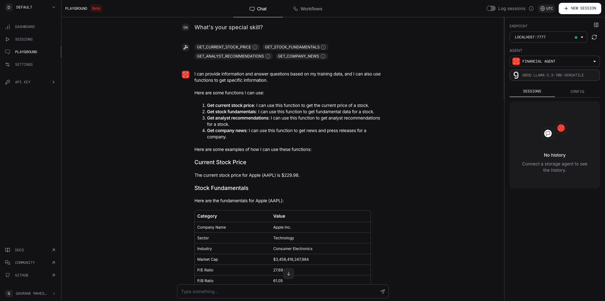
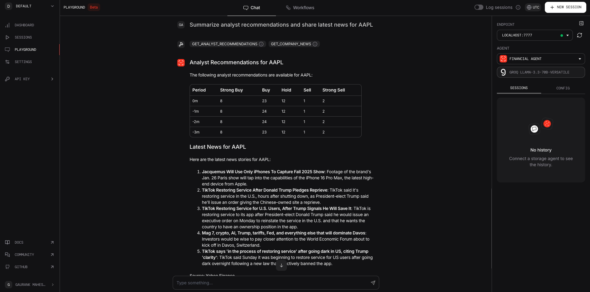
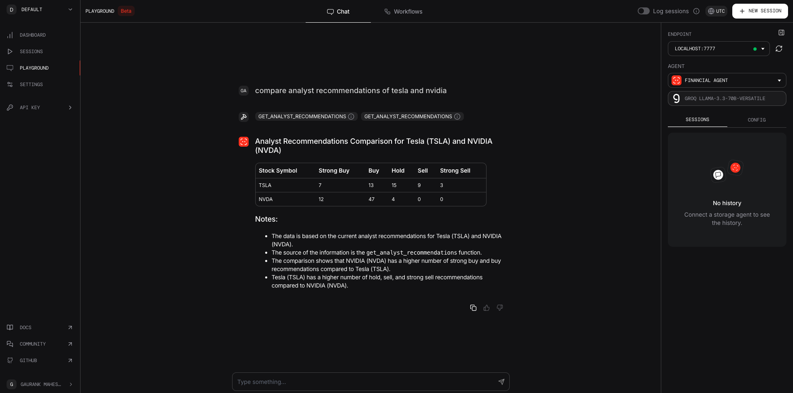

# Financial-Agentic-AI-chatbot

## Overview  
This project focuses on building a **Financial Agentic AI** by integrating cutting-edge tools and platforms. The system is designed to analyze financial data, retrieve relevant information from the web, and provide insights efficiently using cloud-based deployment via **Groq Cloud Playground**.  

---

## Screenshots

### 1. Groq Cloud Playground Integration


### 2. Financial Data Analysis


### 3. Deployment Dashboard


---

## Features  
- **Integrated Data Sources**: Combines data from PHI Data, Y Finance, and DuckDuckGo.  
- **Scalable AI**: Powered by Groq Cloud for efficient, large-scale processing.  
- **API-Driven Architecture**: Built using FastAPI for seamless integration with other systems.  
- **User-Friendly Deployment**: Easy deployment in Groq Cloud Playground.  

---

## Installation  

### Prerequisites  
Ensure that you have:  
- Python **3.12** installed.  
- Access to **Groq Cloud Playground** and its CLI tools.  

### Setup  
1. Clone the repository:  
   ```bash  
   git clone https://github.com/YourUsername/financial-agentic-ai.git  
   cd financial-agentic-ai
2. Install the required python libraries:
   ```bash
   pip install -r requirements.txt

---

## Requirements

The project requires **Python 3.12** and the following libraries:

- **[phidata](https://pypi.org/project/phidata/)** - Simplifies cloud-native development and automation.
- **[python-dotenv](https://pypi.org/project/python-dotenv/)** - For managing environment variables.
- **[yfinance](https://pypi.org/project/yfinance/)** - Yahoo Finance API wrapper.
- **[packaging](https://pypi.org/project/packaging/)** - Utilities for Python package metadata.
- **[duckduckgo-search](https://pypi.org/project/duckduckgo-search/)** - DuckDuckGo search engine integration.
- **[fastapi](https://fastapi.tiangolo.com/)** - High-performance API framework.
- **[uvicorn](https://pypi.org/project/uvicorn/)** - ASGI server for FastAPI.
- **[groq](https://groq.com/)** - Tools and libraries for Groq Cloud integration.
- **[python-docx](https://pypi.org/project/python-docx/)** - For generating Word documents.
- **[python-multipart](https://pypi.org/project/python-multipart/)** - For handling file uploads.


